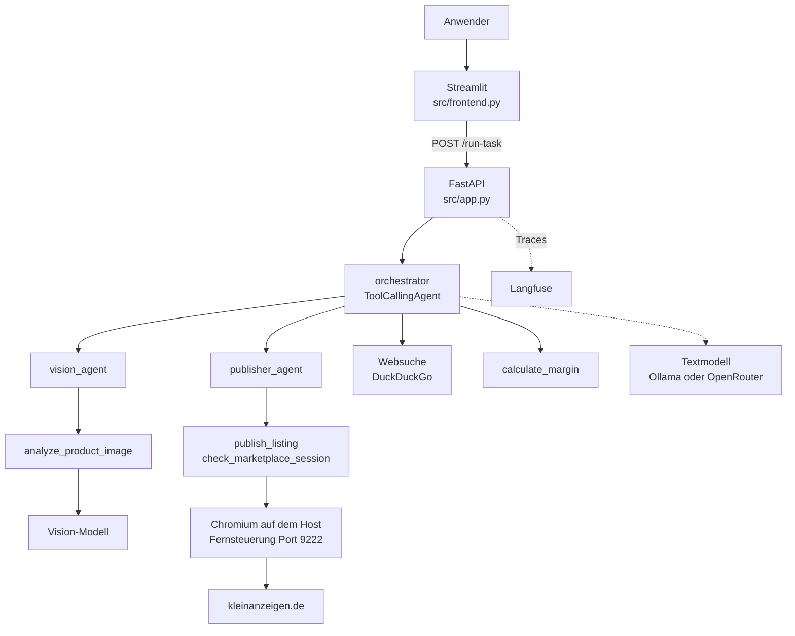

# Architektur und Entwurfsentscheidungen

> Erfüllt Abgabepunkt 2: *"Detaillierte Projektdokumentation als Markdown-Datei
> im Repository, nicht nur eine README, sondern eine vollständige Beschreibung
> des Systems: Architektur, Entwurfsentscheidungen, Funktionsweise, Grenzen."*
>
> Die Bedienung steht in der [README](../README.md), der Nachweis der einzelnen
> Anforderungen in [requirements.md](requirements.md).

## 1. Was das System tut

Einen gebrauchten Gegenstand online zu verkaufen ist überwiegend Schreibarbeit:
herausfinden, was das Ding genau ist, vergleichbare Angebote suchen, einen Preis
festlegen, Titel und Beschreibung formulieren und alles in ein Formular tippen.

SmartSellerAgent nimmt ein einziges Foto und liefert daraus eine fertige
deutschsprachige Verkaufsanzeige mit Titel, Beschreibungstext und Preisvorschlag.
Auf Wunsch trägt er sie zusätzlich in das Anzeigenformular von kleinanzeigen.de
ein. Der letzte Klick bleibt beim Menschen, sofern er ihn nicht ausdrücklich
abgibt.

Ein vollständiger Lauf sieht so aus: Der Anwender lädt in der Weboberfläche ein
Foto seines Regals hoch. Der `vision_agent` erkennt "IKEA Kallax, gebraucht, gut
erhalten". Der Orchestrator recherchiert mit einer Websuche, was vergleichbare
Regale kosten, legt 45 € fest und formuliert Titel und Text. Der
`publisher_agent` prüft die Anmeldung, öffnet das Formular im Browser und füllt
alle Felder aus. Am Ende steht das ausgefüllte Formular im Browserfenster des
Anwenders, und in der Oberfläche steht, was tatsächlich passiert ist.

Zielgruppe sind Privatpersonen, die gelegentlich etwas verkaufen. Die Anwendung
ist für den Betrieb durch eine einzelne Person auf dem eigenen Rechner gebaut,
nicht für einen Mehrbenutzerbetrieb.

## 2. Die Komponenten



**Frontend** (`src/frontend.py`, Streamlit). Nimmt das Bild entgegen, zeigt den
Stand der Anmeldung in der Seitenleiste, bietet den Schalter für das
Veröffentlichen an und stellt das Ergebnis dar. Es enthält bewusst keine
Fachlogik: Alles, was es weiß, holt es über HTTP vom Backend.

**Backend** (`src/app.py`, FastAPI). Der eigentliche Dienst. Er stellt neben
`/health` und `/run-task` die Endpunkte bereit, die die Anmeldung beim Marktplatz
bedienbar machen:

| Endpunkt | Zweck |
|---|---|
| `GET /health` | Lebenszeichen, dient zugleich als Healthcheck des Containers |
| `POST /run-task` | Startet einen Agentenlauf zu einer benannten Aufgabe |
| `GET/PUT /profile` | Die Einstellungen des Anwenders, derzeit die Postleitzahl |
| `GET/DELETE /marketplace/session` | Stand der Anmeldung lesen oder verwerfen |
| `POST /marketplace/session/verify` | Die Anmeldung wirklich gegen die Website prüfen |
| `POST/GET /marketplace/login` | Anmeldefenster öffnen und den Fortschritt abfragen |
| `POST /marketplace/session/import` | Eine anderswo erzeugte Anmeldung übernehmen |

**Das Agentensystem** (smolagents, `ToolCallingAgent`). Drei Agenten mit
getrennten Rollen, ihre Anweisungen stehen in `src/prompts.yaml`:

* Der **orchestrator** führt den Ablauf. Eigene Werkzeuge: Websuche und
  Margenrechnung. Untergeordnete Agenten: die beiden folgenden. Bis zu 10
  Schritte.
* Der **vision_agent** analysiert ausschließlich Produktfotos und berichtet
  Produkt, Marke und sichtbaren Zustand. Bis zu 4 Schritte.
* Der **publisher_agent** stellt eine fertige Anzeige ein. Er prüft zuerst
  selbst die Anmeldung und bricht ab, wenn sie fehlt. Bis zu 4 Schritte.

**Die Werkzeuge** (`src/tools/`). `vision.py` schickt das Bild base64-kodiert an
das Vision-Modell, `pricing.py` rechnet Gewinn und Marge, und `marketplace.py`
ist mit rund 1400 Zeilen das eigentliche Schwergewicht: Es steuert über Playwright
einen echten Browser durch das Anzeigenformular, verwaltet die gespeicherte
Anmeldung und protokolliert, was es getan hat.

**Die Modelle.** Beide sprechen das OpenAI-Protokoll, deshalb genügt eine andere
Basis-URL, um zwischen einem lokalen Ollama-Container und OpenRouter zu wechseln.
Text- und Vision-Modell werden getrennt konfiguriert und dürfen bei
unterschiedlichen Anbietern liegen.

**Beobachtbarkeit** (`src/tracing.py`). Ein OpenTelemetry-Provider instrumentiert
smolagents und schickt die Spans an Langfuse. Fehlen die Zugangsdaten, läuft
alles unverändert weiter, es wird nur nichts exportiert.

## 3. Wie ein Auftrag durch das System läuft

1. Der Anwender lädt ein Bild hoch. Das Frontend schreibt es in das Volume
   `uploads` und schickt dem Backend den **Dateipfad**, nicht die Datei.
2. `/run-task` sucht die Aufgabe (hier `create_and_publish_listing`) in
   `src/prompts.yaml` und füllt Bildpfad und Einkaufspreis ein.
3. Vor dem Start stellt das Backend über `publish_blocker()` fest, ob überhaupt
   eine Anzeige entstehen kann. Diese Auskunft ist billig, sie prüft nur eine
   TCP-Verbindung und eine Datei.
4. Der Orchestrator arbeitet den Auftrag ab: `vision_agent` beauftragen,
   höchstens zwei Websuchen, Titel und Preis festlegen, `publisher_agent`
   beauftragen.
5. Der `publisher_agent` ruft `check_marketplace_session` und danach
   `publish_listing`. Das Werkzeug öffnet das Formular und füllt es in der
   Reihenfolge aus, die die Website vorgibt: Der Titel schaltet die
   Kategorievorschläge frei, die Kategorie erst den Versand-Abschnitt.
6. Das Backend gibt drei Dinge zurück: den Text des Agenten, das vom Werkzeug
   selbst geschriebene Protokoll (`publish_attempts`) und den vorab ermittelten
   Hinderungsgrund. Die Oberfläche zeigt Protokoll und Grund **über** dem Text.

### Der TAO-Zyklus (P2)

Ein Lauf von `create_and_publish_listing` erzwingt mindestens vier Runden des
Modells, weil drei verschiedene Werkzeuge in fester Reihenfolge nötig sind und
danach noch die Schlussantwort formuliert werden muss. Sichtbar wird der Zyklus
durch `verbosity_level=LogLevel.DEBUG` bei allen drei Agenten. Erst diese Stufe
protokolliert "Output message of the LLM", also den *Thought*; auf der
Standardstufe INFO erscheinen nur Action und Observation.

```bash
docker compose logs -f api
```

## 4. Entwurfsentscheidungen

Der interessante Teil ist das *Warum*. Die folgenden Entscheidungen sind fast
alle aus Fehlschlägen entstanden.

### smolagents als Framework (P3)

Gewählt, weil das Framework klein genug ist, um es vollständig zu verstehen. Ein
`ToolCallingAgent` ist wenig mehr als eine Schleife um Modell und Werkzeuge, und
genau das war für ein Lernprojekt der Punkt: Wo etwas schiefläuft, kann man im
Fremdcode nachlesen, warum. LangGraph bringt ein Graphenmodell mit, das der
Ablauf hier nicht braucht, CrewAI eine Rollenmetaphorik, die wir sonst zweimal
gehabt hätten. Dazu kommt die eingebaute Unterstützung für untergeordnete Agenten
über `managed_agents`, die W1 direkt abdeckt, und eine Anbindung an
OpenTelemetry, die W5 ohne eigenen Code erledigt.

### Drei Agenten statt eines mit vielen Werkzeugen

Die Bildanalyse hätte auch ein Werkzeug des Orchestrators sein können. Getrennt
ist sie, weil die Aufgaben unterschiedliche Anweisungen brauchen: Der
`vision_agent` soll ausdrücklich *keine* Preise schätzen, der `publisher_agent`
soll nicht recherchieren. In einem einzigen Prompt hätten diese Regeln einander
verwässert. Der zweite Grund ist das Kontextfenster: Was der `vision_agent`
gesehen hat, muss der Orchestrator nicht in voller Länge mitschleppen.

### Der Browser läuft auf dem Rechner des Anwenders

Ursprünglich lief Chromium im Container, mit virtuellem Bildschirm und noVNC zum
Zuschauen. Das funktioniert technisch, aber kleinanzeigen.de behandelt diesen
Browser wie ein fremdes Gerät: Software-Grafikausgabe, kaum Schriftarten,
virtueller Bildschirm. Erst kam eine Sicherheitsabfrage, später sperrte der
Anbieter den Adressbereich des Containers für Anmeldungen. Ein Browser auf dem
eigenen Rechner bringt die Umgebung mit, die die Website von diesem Anwender
schon kennt.

Seither ist der Host-Browser der Standard. Der Container hängt sich per Chrome
DevTools Protocol an Port 9222 an, gestartet wird er mit
`uv run python -m scripts.host_browser`. Der Weg über den Container-Browser
bleibt als Rückfall erhalten und lässt sich in der `.env` wieder einschalten.

Zwei Kleinigkeiten waren dabei nötig: Chromium prüft bei DevTools-Anfragen den
Host-Header und lässt nur `localhost` und IP-Adressen zu, deshalb löst
`_cdp_endpoint()` den Namen `host.docker.internal` selbst auf. Und weil die
Fehlermeldung von Playwright ("connect ECONNREFUSED 192.168.65.254:9222")
niemandem weiterhilft, prüfen wir die Erreichbarkeit vorher selbst und werfen
einen eigenen Fehler mit dem Startbefehl darin.

### Eine unumkehrbare Handlung gehört nicht in die Hand des Modells

Das ist die wichtigste Entscheidung des Projekts, und sie hat einen konkreten
Anlass. Bei einem Testlauf meldete der Agent, die Anzeige sei eingestellt worden.
Tatsächlich war nichts geschehen, es war nicht einmal jemand angemeldet. Der
Orchestrator hatte sein Schrittbudget in Websuchen verbraucht, musste eine
Schlussantwort liefern und füllte die geforderte Statuszeile mit der
wahrscheinlichsten Formulierung.

Daraus folgen drei Dinge im Code:

* **Zwei Schalter** müssen zustimmen, damit etwas veröffentlicht wird: die
  Umgebungsvariable `KLEINANZEIGEN_ALLOW_PUBLISH` der Installation und die
  Ankreuzbox für genau diesen einen Lauf. Beides ist standardmäßig aus.
* **Keiner der beiden ist für das Sprachmodell sichtbar.** Das Werkzeug hat kein
  entsprechendes Feld, das Modell kann seine eigene Freigabe also nicht
  argumentieren. Technisch ist die Freigabe ein `ContextVar`, weil FastAPI
  synchrone Endpunkte in einem Threadpool mit wiederverwendeten Threads
  ausführt: Eine schlichte Variable könnte in eine spätere, fremde Anfrage
  lecken.
* **Das Werkzeug protokolliert selbst**, was es getan hat. Die Oberfläche zeigt
  dieses Protokoll und nicht die Zusammenfassung des Modells. Widersprechen sich
  beide, gilt das Protokoll.

### Der Grund für ein leeres Protokoll gehört dazu

Ein leeres Protokoll hieß zunächst nur "das Werkzeug wurde nie aufgerufen", und
die Oberfläche warnte entsprechend. Das ist im häufigsten Fall irreführend: Wer
sich nicht angemeldet hat, bekommt den Anzeigentext trotzdem, und das ist so
gewollt. Deshalb schreibt inzwischen auch die Anmeldeprüfung ihren Befund in
dasselbe Protokoll, und `publish_blocker()` stellt schon vor dem Lauf fest, ob
Browser und Anmeldung überhaupt vorhanden sind. Die Oberfläche sagt dann vorher
*und* nachher, dass nur der Text entsteht. Nebenbei spart das eine Modellrunde,
weil der Nachhol-Versuch für den Veröffentlichungsschritt entfällt, wenn er
ohnehin scheitern müsste.

### Höchstens zwei Websuchen

Der Orchestrator verfing sich wiederholt in Suchen und erreichte sein
Schrittlimit, bevor er zum eigentlichen Ziel kam. Die Obergrenze steht mitsamt
Begründung im Prompt, nicht als bloße Anordnung: Jedes Ergebnis bleibt im
Kontext, und ein ungefährer Preis aus zwei Suchen ist mehr wert als ein perfekter,
der nie verwendet wird. Der Preis dafür ist eine schmalere Stichprobe, siehe
[W12](reflection-w12-drift.md).

### Zwei Compose-Dateien statt einer mit Profilen

`docker-compose.yml` startet die Modelle lokal, `docker-compose.openrouter.yml`
holt sie von OpenRouter. Ein Override wäre eleganter gewesen, scheitert aber an
Compose 2.23: Ein `depends_on` lässt sich in einem Override weder entfernen noch
auf einen profilierten Dienst richten. Der lokale Stack braucht aber genau diese
Reihenfolge, damit die Modelle heruntergeladen sind, bevor der Agent startet.
Ausgewählt wird die Variante über `COMPOSE_FILE` in der `.env`; die Vorlage
setzt den gehosteten Weg, weil ein Lauf dort Minuten statt Dutzende von Minuten
dauert.

### Reasoning bei Qwen3 abschalten

Kein Feinschliff, sondern Voraussetzung: smolagents setzt bei einem
`ToolCallingAgent` `tool_choice=required`, und Qwen3 lehnt das im Reasoning-Modus
ab. Gegen OpenRouter setzt `src/config.py` deshalb von sich aus
`{"reasoning": {"enabled": false}}`, überschreibbar über `MODEL_EXTRA_BODY`.

### Prompts in YAML

`src/prompts.yaml` trennt die Anweisungen vom Code. Das war weniger eine Frage
der Sauberkeit als der Arbeitsgeschwindigkeit: Fast jede Verbesserung an diesem
System war eine Änderung am Prompt, und die soll man lesen und vergleichen
können, ohne durch Python-Strings zu blättern.

### `BatchSpanProcessor` statt `SimpleSpanProcessor`

Spans werden aus einem Hintergrund-Thread gebündelt exportiert, damit das Tracing
nicht im kritischen Pfad liegt. Der Preis ist, dass beim Herunterfahren noch
etwas in der Warteschlange stehen kann. Deshalb leert der FastAPI-Lifespan sie
beim Beenden, und die Container bekommen mit `stop_grace_period: 30s` die Zeit
dafür.

## 5. Konfiguration

Alles läuft über Umgebungsvariablen, gelesen in `src/config.py`, dokumentiert in
[.env.example](../.env.example). Ohne `.env` startet der lokale Stack mit
sinnvollen Vorgaben, es ist also nichts einzurichten, um das System überhaupt zu
sehen.

Die Zustandsdaten liegen in benannten Volumes und nicht im Image: `uploads` teilen
sich Frontend und Backend, `marketplace-state` enthält die gespeicherte Anmeldung
und das Profil, `ollama-models` die heruntergeladenen Modelle. Die Anmeldung ist
faktisch ein angemeldetes Konto und wird entsprechend behandelt: nie im Image,
nie in git.

## 6. Tests

158 Testfälle in `test/`, ausgeführt von der CI bei jedem Push
(`.github/workflows/ci.yml`). Kein Test startet einen Browser oder ruft ein
Modell auf. Das Formular wird gegen ein Double geprüft, das die Eigenheiten der
echten Seite nachbildet, die uns Fehlschläge eingebracht haben: Kategorien
erscheinen erst nach der Titeleingabe, der Versand-Abschnitt erst nach der
Kategoriewahl, und ein nachgeladener Entwurf kann frisch gesetzte Felder wieder
überschreiben.

## 7. Grenzen und bekannte Probleme

* **Lokale Inferenz ist langsam.** Gemessen rund 3,6 Minuten pro Modellaufruf auf
  der CPU, und ein Lauf kettet mehrere davon. Siehe
  [performance.md](performance.md).
* **Das Frontend übergibt einen Dateipfad**, keine Datei. Beide Container müssen
  deshalb dasselbe Verzeichnis sehen. Über ein Volume gelöst, aber als
  Schnittstelle nicht robust.
* **Keine Authentifizierung** an Frontend und API, keine Ratenbegrenzung. Die
  noVNC-Ansicht des Rückfallwegs läuft ohne Passwort, deshalb ist ihr Port
  ausdrücklich nur an `127.0.0.1` gebunden.
* **Die Oberfläche sagt nicht, welcher Betriebsart sie folgt.** Im gehosteten
  Modus verlässt jedes Produktfoto den Rechner, das steht aber nur in der
  Konfiguration. Siehe [W14](reflection-w14-responsible-ai.md).
* **Die Selektoren des Formulars sind fest verdrahtet.** Die Website hat keine
  Schnittstelle, jede Umgestaltung bricht das Werkzeug. Siehe
  [W12](reflection-w12-drift.md).
* **Die Preisschätzung ist eine Empfehlung, kein Gutachten.** Sie hängt an dem,
  was zwei Websuchen hergeben, und an einem Modell, dessen Preisgefühl auf dem
  Stand seines Trainings eingefroren ist.
* **Kleine Modelle sind beim Werkzeugaufruf unzuverlässig.** Der lokale Weg mit
  `qwen3:1.7b` scheitert deutlich öfter als der gehostete.
* **Es wird genau ein Bild verarbeitet** und genau eines in die Anzeige
  übernommen (Issue
  [#47](https://github.com/SmartSeller-Agent/SmartSellerAgent/issues/47)).
* **Hochgeladene Bilder werden nicht aufgeräumt.** Sie sammeln sich im Volume
  `uploads`, bis es von Hand entfernt wird.


---
*english version*
# Architecture and design decisions