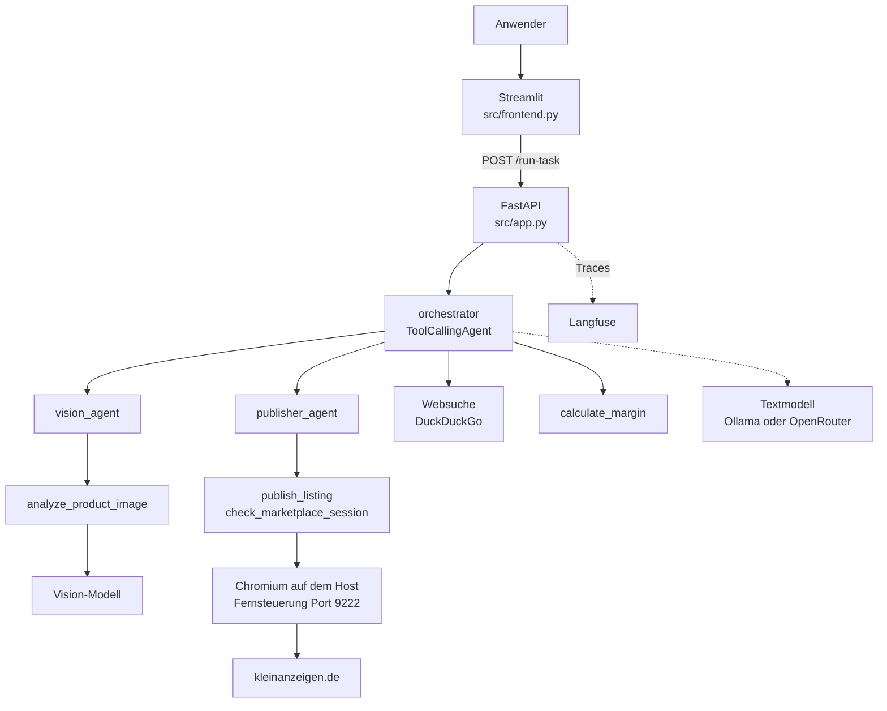

<a id="architecture-top"></a>

# Architektur und Entwurfsentscheidungen

*[english version below](#architecture-and-design-decisions)*

> [!NOTE]
> Erfüllt Abgabepunkt 2: *"Detaillierte Projektdokumentation als Markdown-Datei
> im Repository, nicht nur eine README, sondern eine vollständige Beschreibung
> des Systems: Architektur, Entwurfsentscheidungen, Funktionsweise, Grenzen."*
>
> Die Bedienung steht in der [README](../README.md), der Nachweis der einzelnen
> Anforderungen in [requirements.md](requirements.md).

## 1. Was das System tut

Einen gebrauchten Gegenstand online zu verkaufen ist überwiegend Schreibarbeit:
herausfinden, was das Ding genau ist, vergleichbare Angebote suchen, einen Preis
festlegen, Titel und Beschreibung formulieren und alles in ein Formular tippen.

SmartSellerAgent nimmt ein einziges Foto und liefert daraus eine fertige
deutschsprachige Verkaufsanzeige mit Titel, Beschreibungstext und Preisvorschlag.
Auf Wunsch trägt er sie zusätzlich in das Anzeigenformular von kleinanzeigen.de
ein. Der letzte Klick bleibt beim Menschen, sofern er ihn nicht ausdrücklich
abgibt.

Ein vollständiger Lauf sieht so aus: Der Anwender lädt in der Weboberfläche ein
Foto seines Regals hoch. Der `vision_agent` erkennt "IKEA Kallax, gebraucht, gut
erhalten". Der Orchestrator recherchiert mit einer Websuche, was vergleichbare
Regale kosten, legt 45 € fest und formuliert Titel und Text. Der
`publisher_agent` prüft die Anmeldung, öffnet das Formular im Browser und füllt
alle Felder aus. Am Ende steht das ausgefüllte Formular im Browserfenster des
Anwenders, und in der Oberfläche steht, was tatsächlich passiert ist.

Zielgruppe sind Privatpersonen, die gelegentlich etwas verkaufen. Die Anwendung
ist für den Betrieb durch eine einzelne Person auf dem eigenen Rechner gebaut,
nicht für einen Mehrbenutzerbetrieb.

## 2. Die Komponenten



**Frontend** (`src/frontend.py`, Streamlit). Nimmt das Bild entgegen, zeigt den
Stand der Anmeldung in der Seitenleiste, bietet den Schalter für das
Veröffentlichen an und stellt das Ergebnis dar. Es enthält bewusst keine
Fachlogik: Alles, was es weiß, holt es über HTTP vom Backend.

**Backend** (`src/app.py`, FastAPI). Der eigentliche Dienst. Er stellt neben
`/health` und `/run-task` die Endpunkte bereit, die die Anmeldung beim Marktplatz
bedienbar machen:

| Endpunkt | Zweck |
|---|---|
| `GET /health` | Lebenszeichen, dient zugleich als Healthcheck des Containers |
| `POST /run-task` | Startet einen Agentenlauf zu einer benannten Aufgabe |
| `GET/PUT /profile` | Die Einstellungen des Anwenders, derzeit die Postleitzahl |
| `GET/DELETE /marketplace/session` | Stand der Anmeldung lesen oder verwerfen |
| `POST /marketplace/session/verify` | Die Anmeldung wirklich gegen die Website prüfen |
| `POST/GET /marketplace/login` | Anmeldefenster öffnen und den Fortschritt abfragen |
| `POST /marketplace/session/import` | Eine anderswo erzeugte Anmeldung übernehmen |

**Das Agentensystem** (smolagents, `ToolCallingAgent`). Drei Agenten mit
getrennten Rollen, ihre Anweisungen stehen in `src/prompts.yaml`:

* Der **orchestrator** führt den Ablauf. Eigene Werkzeuge: Websuche und
  Margenrechnung. Untergeordnete Agenten: die beiden folgenden. Bis zu 10
  Schritte.
* Der **vision_agent** analysiert ausschließlich Produktfotos und berichtet
  Produkt, Marke und sichtbaren Zustand. Bis zu 4 Schritte.
* Der **publisher_agent** stellt eine fertige Anzeige ein. Er prüft zuerst
  selbst die Anmeldung und bricht ab, wenn sie fehlt. Bis zu 4 Schritte.

**Die Werkzeuge** (`src/tools/`). `vision.py` schickt das Bild base64-kodiert an
das Vision-Modell, `pricing.py` rechnet Gewinn und Marge, und `marketplace.py`
ist mit rund 1400 Zeilen das eigentliche Schwergewicht: Es steuert über Playwright
einen echten Browser durch das Anzeigenformular, verwaltet die gespeicherte
Anmeldung und protokolliert, was es getan hat.

**Die Modelle.** Beide sprechen das OpenAI-Protokoll, deshalb genügt eine andere
Basis-URL, um zwischen einem lokalen Ollama-Container und OpenRouter zu wechseln.
Text- und Vision-Modell werden getrennt konfiguriert und dürfen bei
unterschiedlichen Anbietern liegen.

**Beobachtbarkeit** (`src/tracing.py`). Ein OpenTelemetry-Provider instrumentiert
smolagents und schickt die Spans an Langfuse. Fehlen die Zugangsdaten, läuft
alles unverändert weiter, es wird nur nichts exportiert.

## 3. Wie ein Auftrag durch das System läuft

1. Der Anwender lädt ein Bild hoch. Das Frontend schreibt es in das Volume
   `uploads` und schickt dem Backend den **Dateipfad**, nicht die Datei.
2. `/run-task` sucht die Aufgabe (hier `create_and_publish_listing`) in
   `src/prompts.yaml` und füllt Bildpfad und Einkaufspreis ein.
3. Vor dem Start stellt das Backend über `publish_blocker()` fest, ob überhaupt
   eine Anzeige entstehen kann. Diese Auskunft ist billig, sie prüft nur eine
   TCP-Verbindung und eine Datei.
4. Der Orchestrator arbeitet den Auftrag ab: `vision_agent` beauftragen,
   höchstens zwei Websuchen, Titel und Preis festlegen, `publisher_agent`
   beauftragen.
5. Der `publisher_agent` ruft `check_marketplace_session` und danach
   `publish_listing`. Das Werkzeug öffnet das Formular und füllt es in der
   Reihenfolge aus, die die Website vorgibt: Der Titel schaltet die
   Kategorievorschläge frei, die Kategorie erst den Versand-Abschnitt.
6. Das Backend gibt drei Dinge zurück: den Text des Agenten, das vom Werkzeug
   selbst geschriebene Protokoll (`publish_attempts`) und den vorab ermittelten
   Hinderungsgrund. Die Oberfläche zeigt Protokoll und Grund **über** dem Text.

### Der TAO-Zyklus (P2)

Ein Lauf von `create_and_publish_listing` erzwingt mindestens vier Runden des
Modells, weil drei verschiedene Werkzeuge in fester Reihenfolge nötig sind und
danach noch die Schlussantwort formuliert werden muss. Sichtbar wird der Zyklus
durch `verbosity_level=LogLevel.DEBUG` bei allen drei Agenten. Erst diese Stufe
protokolliert "Output message of the LLM", also den *Thought*; auf der
Standardstufe INFO erscheinen nur Action und Observation.

```bash
docker compose logs -f api
```

## 4. Entwurfsentscheidungen

Der interessante Teil ist das *Warum*. Die folgenden Entscheidungen sind fast
alle aus Fehlschlägen entstanden.

### smolagents als Framework (P3)

Gewählt, weil das Framework klein genug ist, um es vollständig zu verstehen. Ein
`ToolCallingAgent` ist wenig mehr als eine Schleife um Modell und Werkzeuge, und
genau das war für ein Lernprojekt der Punkt: Wo etwas schiefläuft, kann man im
Fremdcode nachlesen, warum. LangGraph bringt ein Graphenmodell mit, das der
Ablauf hier nicht braucht, CrewAI eine Rollenmetaphorik, die wir sonst zweimal
gehabt hätten. Dazu kommt die eingebaute Unterstützung für untergeordnete Agenten
über `managed_agents`, die W1 direkt abdeckt, und eine Anbindung an
OpenTelemetry, die W5 ohne eigenen Code erledigt.

### Drei Agenten statt eines mit vielen Werkzeugen

Die Bildanalyse hätte auch ein Werkzeug des Orchestrators sein können. Getrennt
ist sie, weil die Aufgaben unterschiedliche Anweisungen brauchen: Der
`vision_agent` soll ausdrücklich *keine* Preise schätzen, der `publisher_agent`
soll nicht recherchieren. In einem einzigen Prompt hätten diese Regeln einander
verwässert. Der zweite Grund ist das Kontextfenster: Was der `vision_agent`
gesehen hat, muss der Orchestrator nicht in voller Länge mitschleppen.

### Der Browser läuft auf dem Rechner des Anwenders

Ursprünglich lief Chromium im Container, mit virtuellem Bildschirm und noVNC zum
Zuschauen. Das funktioniert technisch, aber kleinanzeigen.de behandelt diesen
Browser wie ein fremdes Gerät: Software-Grafikausgabe, kaum Schriftarten,
virtueller Bildschirm. Erst kam eine Sicherheitsabfrage, später sperrte der
Anbieter den Adressbereich des Containers für Anmeldungen. Ein Browser auf dem
eigenen Rechner bringt die Umgebung mit, die die Website von diesem Anwender
schon kennt.

Seither ist der Host-Browser der Standard. Der Container hängt sich per Chrome
DevTools Protocol an Port 9222 an, gestartet wird er mit
`uv run python -m scripts.host_browser`. Der Weg über den Container-Browser
bleibt als Rückfall erhalten und lässt sich in der `.env` wieder einschalten.

Zwei Kleinigkeiten waren dabei nötig: Chromium prüft bei DevTools-Anfragen den
Host-Header und lässt nur `localhost` und IP-Adressen zu, deshalb löst
`_cdp_endpoint()` den Namen `host.docker.internal` selbst auf. Und weil die
Fehlermeldung von Playwright ("connect ECONNREFUSED 192.168.65.254:9222")
niemandem weiterhilft, prüfen wir die Erreichbarkeit vorher selbst und werfen
einen eigenen Fehler mit dem Startbefehl darin.

### Eine unumkehrbare Handlung gehört nicht in die Hand des Modells

Das ist die wichtigste Entscheidung des Projekts, und sie hat einen konkreten
Anlass. Bei einem Testlauf meldete der Agent, die Anzeige sei eingestellt worden.
Tatsächlich war nichts geschehen, es war nicht einmal jemand angemeldet. Der
Orchestrator hatte sein Schrittbudget in Websuchen verbraucht, musste eine
Schlussantwort liefern und füllte die geforderte Statuszeile mit der
wahrscheinlichsten Formulierung.

Daraus folgen drei Dinge im Code:

* **Zwei Schalter** müssen zustimmen, damit etwas veröffentlicht wird: die
  Umgebungsvariable `KLEINANZEIGEN_ALLOW_PUBLISH` der Installation und die
  Ankreuzbox für genau diesen einen Lauf. Beides ist standardmäßig aus.
* **Keiner der beiden ist für das Sprachmodell sichtbar.** Das Werkzeug hat kein
  entsprechendes Feld, das Modell kann seine eigene Freigabe also nicht
  argumentieren. Technisch ist die Freigabe ein `ContextVar`, weil FastAPI
  synchrone Endpunkte in einem Threadpool mit wiederverwendeten Threads
  ausführt: Eine schlichte Variable könnte in eine spätere, fremde Anfrage
  lecken.
* **Das Werkzeug protokolliert selbst**, was es getan hat. Die Oberfläche zeigt
  dieses Protokoll und nicht die Zusammenfassung des Modells. Widersprechen sich
  beide, gilt das Protokoll.

### Der Grund für ein leeres Protokoll gehört dazu

Ein leeres Protokoll hieß zunächst nur "das Werkzeug wurde nie aufgerufen", und
die Oberfläche warnte entsprechend. Das ist im häufigsten Fall irreführend: Wer
sich nicht angemeldet hat, bekommt den Anzeigentext trotzdem, und das ist so
gewollt. Deshalb schreibt inzwischen auch die Anmeldeprüfung ihren Befund in
dasselbe Protokoll, und `publish_blocker()` stellt schon vor dem Lauf fest, ob
Browser und Anmeldung überhaupt vorhanden sind. Die Oberfläche sagt dann vorher
*und* nachher, dass nur der Text entsteht. Nebenbei spart das eine Modellrunde,
weil der Nachhol-Versuch für den Veröffentlichungsschritt entfällt, wenn er
ohnehin scheitern müsste.

### Höchstens zwei Websuchen

Der Orchestrator verfing sich wiederholt in Suchen und erreichte sein
Schrittlimit, bevor er zum eigentlichen Ziel kam. Die Obergrenze steht mitsamt
Begründung im Prompt, nicht als bloße Anordnung: Jedes Ergebnis bleibt im
Kontext, und ein ungefährer Preis aus zwei Suchen ist mehr wert als ein perfekter,
der nie verwendet wird. Der Preis dafür ist eine schmalere Stichprobe, siehe
[W12](reflection-w12-drift.md).

### Zwei Compose-Dateien statt einer mit Profilen

`docker-compose.yml` startet die Modelle lokal, `docker-compose.openrouter.yml`
holt sie von OpenRouter. Ein Override wäre eleganter gewesen, scheitert aber an
Compose 2.23: Ein `depends_on` lässt sich in einem Override weder entfernen noch
auf einen profilierten Dienst richten. Der lokale Stack braucht aber genau diese
Reihenfolge, damit die Modelle heruntergeladen sind, bevor der Agent startet.
Ausgewählt wird die Variante über `COMPOSE_FILE` in der `.env`; die Vorlage
setzt den gehosteten Weg, weil ein Lauf dort Minuten statt Dutzende von Minuten
dauert.

### Reasoning bei Qwen3 abschalten

Kein Feinschliff, sondern Voraussetzung: smolagents setzt bei einem
`ToolCallingAgent` `tool_choice=required`, und Qwen3 lehnt das im Reasoning-Modus
ab. Gegen OpenRouter setzt `src/config.py` deshalb von sich aus
`{"reasoning": {"enabled": false}}`, überschreibbar über `MODEL_EXTRA_BODY`.

### Prompts in YAML

`src/prompts.yaml` trennt die Anweisungen vom Code. Das war weniger eine Frage
der Sauberkeit als der Arbeitsgeschwindigkeit: Fast jede Verbesserung an diesem
System war eine Änderung am Prompt, und die soll man lesen und vergleichen
können, ohne durch Python-Strings zu blättern.

### `BatchSpanProcessor` statt `SimpleSpanProcessor`

Spans werden aus einem Hintergrund-Thread gebündelt exportiert, damit das Tracing
nicht im kritischen Pfad liegt. Der Preis ist, dass beim Herunterfahren noch
etwas in der Warteschlange stehen kann. Deshalb leert der FastAPI-Lifespan sie
beim Beenden, und die Container bekommen mit `stop_grace_period: 30s` die Zeit
dafür.

## 5. Konfiguration

Alles läuft über Umgebungsvariablen, gelesen in `src/config.py`, dokumentiert in
[.env.example](../.env.example). Ohne `.env` startet der lokale Stack mit
sinnvollen Vorgaben, es ist also nichts einzurichten, um das System überhaupt zu
sehen.

Die Zustandsdaten liegen in benannten Volumes und nicht im Image: `uploads` teilen
sich Frontend und Backend, `marketplace-state` enthält die gespeicherte Anmeldung
und das Profil, `ollama-models` die heruntergeladenen Modelle. Die Anmeldung ist
faktisch ein angemeldetes Konto und wird entsprechend behandelt: nie im Image,
nie in git.

## 6. Tests

158 Testfälle in `test/`. Kein Test startet einen Browser oder ruft ein
Modell auf. Das Formular wird gegen ein Double geprüft, das die Eigenheiten der
echten Seite nachbildet, die uns Fehlschläge eingebracht haben: Kategorien
erscheinen erst nach der Titeleingabe, der Versand-Abschnitt erst nach der
Kategoriewahl, und ein nachgeladener Entwurf kann frisch gesetzte Felder wieder
überschreiben.

## 7. Grenzen und bekannte Probleme

> siehe [Known Limitations and Issues in README](../README.md#known-limitations-and-issues)

<p align="right">(<a href="#architecture-top">back to top</a>)</p>

---
*english version translated using DeepL*

# Architecture and design decisions

> [!NOTE]
> Meets submission criterion 2: *"Detailed project documentation as a Markdown file
> in the repository – not just a README, but a complete description
> of the system: architecture, design decisions, how it works, limitations."*
>
> The user guide is in the [README](../README.md), and evidence of the individual
> requirements is in [requirements.md](requirements.md).

## 1. What the system does

Selling a second-hand item online is mostly paperwork:
finding out exactly what the item is, searching for comparable listings, setting a price,
drafting a title and description, and typing it all into a form.

SmartSellerAgent takes a single photo and uses it to generate a ready-to-go
German-language sales advert complete with title, description and suggested price.
If requested, it also enters the details into the advert form on kleinanzeigen.de. 
The final click is left to the user, unless they explicitly choose to do so themselves.

A complete workflow looks like this: The user uploads a photo of their shelving unit to the web interface. The `vision_agent` recognises “IKEA Kallax, second-hand, in good
condition”. The Orchestrator uses a web search to find out what comparable
shelving units cost, sets the price at €45 and drafts the title and text. The
`publisher_agent` checks the listing, opens the form in the browser and fills in
all the fields. Finally, the completed form appears in the user’s browser window, and the interface displays what actually happened.

The target audience is private individuals who occasionally sell items. The application is designed to be run by a single person on their own computer, not for multi-user operation.

## 2. The components


**Frontend** (`src/frontend.py`, Streamlit). Receives the image, displays the
registration status in the sidebar, provides the button for
publishing, and displays the result. It deliberately contains no
business logic: everything it knows is retrieved via HTTP from the backend.

**Backend** (`src/app.py`, FastAPI). The actual service. In addition to
`/health` and `/run-task`, it provides the endpoints that enable registration with the marketplace:

| Endpoint | Purpose |
|---|---|
| `GET /health` | Vital signs; also serves as a health check for the container |
| `POST /run-task` | Starts an agent run for a named task |
| `GET/PUT /profile` | The user’s settings; currently the postcode |
| `GET/DELETE /marketplace/session` | Read or discard the login status |
| `POST /marketplace/session/verify` | Verify the login against the website |
| `POST/GET /marketplace/login` | Open the login window and query the progress |
| `POST /marketplace/session/import` | Import a login created elsewhere |

**The agent system** (smolagents, `ToolCallingAgent`). Three agents with
distinct roles; their instructions are contained in `src/prompts.yaml`:

* The **orchestrator** manages the workflow. Its own tools: web search and
  margin calculation. Subordinate agents: the following two. Up to 10
  steps.
* The **vision_agent** analyses product photos exclusively and reports on the
  product, brand and visible condition. Up to 4 steps.
* The **publisher_agent** posts a finished advert. It first checks the registration details itself and aborts if they are missing. Up to 4 steps.
* The **tools** (`src/tools/`). `vision.py` sends the image in base64-encoded form to the Vision model, `pricing.py` calculates profit and margin, and

**The tools** (`src/tools/`). `vision.py` sends the image, base64-encoded, to
the vision model, `pricing.py` calculates profit and margin, and `marketplace.py`
—with around 1,400 lines—is the real heavyweight: It uses Playwright to navigate a real browser through the listing form, manages the saved registration and logs what it has done.

**The models.** Both use the OpenAI protocol, so a different base URL is all that is needed to switch between a local Ollama container and OpenRouter.
The text and vision models are configured separately and may be hosted by
different providers.

**Observability** (`src/tracing.py`). An OpenTelemetry provider instruments
smolagents and sends the spans to Langfuse. If the credentials are missing, everything continues to run unchanged; nothing is simply exported.

## 3. How a task flows through the system

1. The user uploads an image. The frontend writes it to the `uploads` volume
   and sends the **file path** to the backend, not the file itself.
2. `/run-task` searches for the task (in this case `create_and_publish_listing`) in
   `src/prompts.yaml` and populates the image path and purchase price.
3. Before starting, the backend uses `publish_blocker()` to determine whether
   a listing can be created at all. This check is straightforward; it simply verifies a
   TCP connection and a file.
4. The orchestrator processes the request: instruct the `vision_agent`,
   perform a maximum of two web searches, set the title and price, and instruct the `publisher_agent`
   .
5. The `publisher_agent` calls `check_marketplace_session` and then
   `publish_listing`. The tool opens the form and fills it in the order specified by the website: the title unlocks the category suggestions, and the category unlocks the delivery section.
6. The backend returns three items: the agent’s text, the log generated by the tool itself (`publish_attempts`) and the previously identified reason for failure. The interface displays the log and the reason **above** the text.

### The TAO cycle (P2)

A run of `create_and_publish_listing` triggers at least four rounds of the
model, because three different tools are required in a fixed order and
the final response must then be formulated. The cycle becomes visible
with `verbosity_level=LogLevel.DEBUG` for all three agents. Only this level
logs the “Output message of the LLM”, i.e. the *Thought*; at the
default INFO level, only Action and Observation appear.

```bash
docker compose logs -f api
```

## 4. Design decisions

The interesting part is the *why*. Almost all of the following decisions arose from failures.

### smolagents as a framework (P3)

Chosen because the framework is small enough to be fully understood. A
`ToolCallingAgent` is little more than a loop around the model and tools, and
that was precisely the point for a learning project: where something goes wrong, you can look in the
third-party code to see why. LangGraph comes with a graph model that the
workflow here doesn’t need, whilst CrewAI provides a role-based metaphor that we would otherwise have had to implement twice. In addition, there is built-in support for subordinate agents via `managed_agents`, which directly addresses W1, and an integration with OpenTelemetry, which handles W5 without the need for custom code.

### Three agents instead of one with lots of tools

The image analysis could also have been a tool of the orchestrator. It is separate
because the tasks require different instructions: the
`vision_agent` is explicitly not supposed to estimate *any* prices, and the `publisher_agent`
is not supposed to carry out research. In a single prompt, these rules would have diluted each other’s effect. The second reason is the context window: the orchestrator does not need to carry the full details of what the `vision_agent` has seen.

### The browser runs on the user’s computer

Originally, Chromium ran in a container, with a virtual screen and noVNC for
viewing. This works technically, but kleinanzeigen.de treats this
browser as an external device: software graphics output, hardly any fonts,
virtual screen. First, a security prompt appeared; later, the
provider blocked the container’s address range for logins. A browser on the
user’s own computer brings with it the environment that the website already knows from this user.


Since then, the host browser has been the default. The container connects via the Chrome
DevTools Protocol on port 9222; it is started with
`uv run python -m scripts.host_browser`. The container browser route remains available as a fallback and can be re-enabled in the `.env` file.

Two minor adjustments were required: Chromium checks the
Host header for DevTools requests and only allows `localhost` and IP addresses, which is why
`_cdp_endpoint()` resolves the name `host.docker.internal` itself. And because the
Playwright error message (“connect ECONNREFUSED 192.168.65.254:9222”)
is of no help to anyone, we check the connectivity ourselves beforehand and throw
our own error containing the start command.

### An irreversible action does not belong in the model’s control

This is the most important decision of the project, and it has a specific
reason. During a test run, the agent reported that the advert had been deactivated.
In fact, nothing had happened; no one had even logged in. The
orchestrator had used up its step budget on web searches, had to provide a
provide a final response and filled the required status line with the
most likely wording.

This results in three changes to the code:

* **Two switches** must be set to allow something to be published: the installation’s
  environment variable `KLEINANZEIGEN_ALLOW_PUBLISH` and the
  checkbox for this specific run. Both are disabled by default.
* **Neither of these is visible to the language model.** The tool has no
  corresponding field, so the model cannot justify its own approval. Technically, the approval is a `ContextVar`, because FastAPI
  executes synchronous endpoints in a thread pool with reused threads:
  A simple variable could leak into a later, unrelated request.
* **The tool itself logs** what it has done. The interface displays
  this log rather than the model’s summary. If the two
  contradict each other, the log takes precedence.

  ### The reason for an empty log is part of this

Initially, an empty log simply meant “the tool was never called”, and
the interface displayed a warning to that effect. In most cases, this is misleading: anyone who
has not logged in will still see the warning message, and that is by design.
 That is why the login check now also writes its result to the same log, and `publish_blocker()` determines, even before execution, whether a browser and login are present at all. The interface then states both before and after that only the text is generated. Incidentally, this saves a modelling cycle,
as the catch-up attempt for the publication step is omitted if it
would be bound to fail anyway.

### A maximum of two web searches

The Orchestrator repeatedly got bogged down in searches and reached its
step limit before reaching the actual target. The upper limit is specified in the prompt along with a
reason, not as a mere instruction: every result remains within the
context, and an approximate result from two searches is worth more than a perfect one,
which is never used. The trade-off is a narrower sample, see
[W12](reflection-w12-drift.md).

### Two Compose Files Instead of One with Profiles

`docker-compose.yml` starts the models locally, while `docker-compose.openrouter.yml`
fetches them from OpenRouter. An override would have been more elegant, but it fails due to
Compose 2.23: A `depends_on` cannot be removed in an override, nor can it
be directed at a profiled service. However, the local stack requires exactly this
order so that the models are downloaded before the agent starts.
The variant is selected via `COMPOSE_FILE` in the `.env` file; the template
sets the hosted path because a run there takes minutes instead of dozens of minutes
.

### Disable reasoning in Qwen3

This isn’t a fine-tuning, but a prerequisite: smolagents sets
`ToolCallingAgent`, and Qwen3 rejects this in reasoning mode
. To work with OpenRouter, `src/config.py` therefore automatically sets
`{“reasoning”: {“enabled”: false}}`, which can be overridden via `MODEL_EXTRA_BODY`.

### Prompts in YAML

`src/prompts.yaml` separates the instructions from the code. This was less a matter
of code cleanliness than of work efficiency: Almost every improvement to this
system involved a change to the prompt, and you should be able to read and compare
them without having to scroll through Python strings

### `BatchSpanProcessor` instead of `SimpleSpanProcessor`

Spans are exported in batches from a background thread so that tracing
does not lie on the critical path. The trade-off is that there may still be
some items left in the queue during shutdown. Therefore, the FastAPI Lifespan empties it
upon termination, and the containers are given the time
to do so with `stop_grace_period: 30s`.

## 5. Configuration

Everything is controlled via environment variables, read from `src/config.py` and documented in
[.env.example](../.env.example). Without `.env`, the local stack starts with
reasonable defaults, so there’s nothing to set up just to
get the system running.

The state data is stored in named volumes rather than in the image: `uploads` is
shared by the frontend and backend, `marketplace-state` contains the saved login
and profile, and `ollama-models` contains the downloaded models. The login is
effectively a logged-in account and is treated accordingly: never in the image,
never in git.

## 6. Tests

158 test cases in `test/`. No test launches a browser or calls a
model. The form is validated against a double that replicates the peculiarities of the
real page that caused our failures: Categories
appear only after the title is entered, the shipping section only after the
category is selected, and a reloaded draft can overwrite fields that were just
entered.

## 7. Limitations and known issues

> see [Known Limitations and Issues in README](../README.md#known-limitations-and-issues)

<p align="right">(<a href="#architecture-top">back to top</a>)</p>